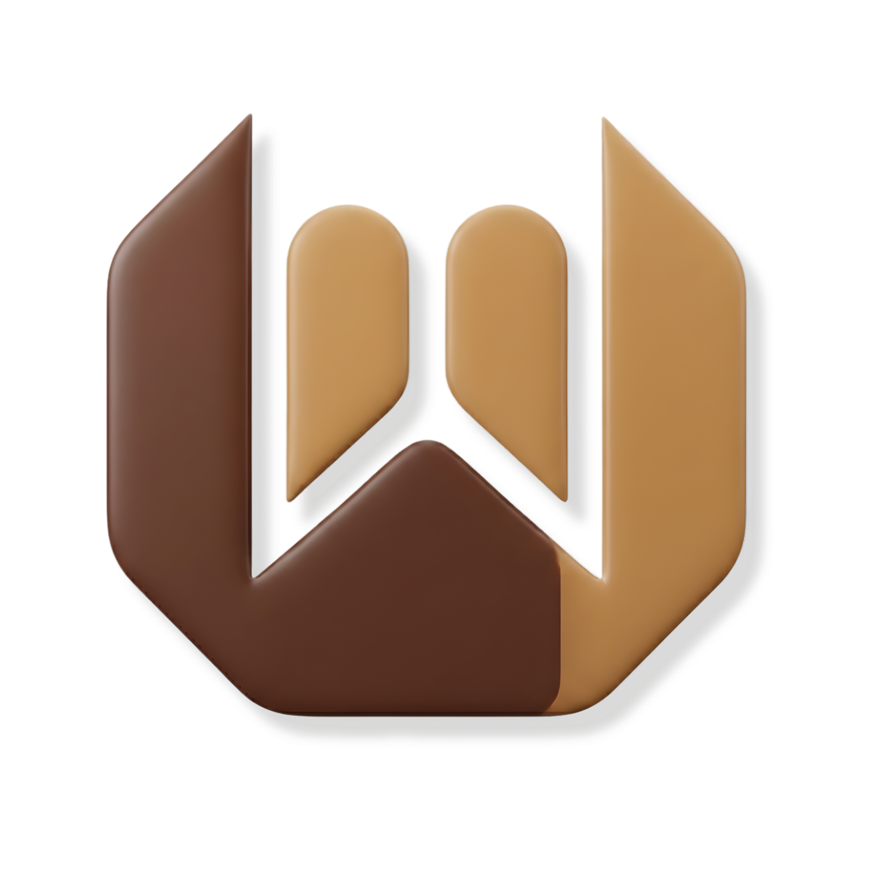

<p align="center">
  
</p>

<h1 align="center">WadahNgopi</h1>

<p align="center">
  <strong>Platform Pencarian Cafe & Roastery Terlengkap di Kalimantan</strong><br>
  <em>Portal Premium untuk Penikmat Kopi Sejati.</em>
</p>

<p align="center">
  <a href="https://laravel.com"></a>
  <a href="https://livewire.laravel.com"></a>
  <a href="https://tailwindcss.com"></a>
  <a href="https://filamentphp.com"></a>
  <a href="https://pestphp.com"></a>
</p>

---

## ✨ Apa Itu WadahNgopi?

**WadahNgopi** adalah portal "Fresh-Premium" yang dirancang untuk mendekatkan ekosistem kopi lokal Kalimantan Timur ke dunia digital. Bukan cuma sekadar direktori, tapi sebuah pengalaman visual yang imersif buat kamu nemuin tempat ngopi paling cocok.

Gak perlu ribet scroll review satu-satu — cukup buka, jelajahi dengan interface yang mewah, dan langsung gas ke cafe atau roastery pilihanmu.

---

## 🎨 Fresh-Premium Experience

Proyek ini telah melalui tahap **UI Overhaul** untuk mencapai standar estetika tertinggi:
- **Golden Frosted Glass**: Estetika *glassmorphism* yang ringan, mewah, dan modern.
- **Reflection Shine**: Animasi "light passing through" pada title yang memberikan kesan *high-end*.
- **Jewelry-Style Iconography**: Ikon yang ringkas dan elegan, layaknya perhiasan di dalam aplikasi.
- **Immersive Layout**: Tampilan full-screen tanpa batas (`100dvh`) yang mengalir mulus di semua perangkat.

---

## 💎 Fitur Unggulan

### 🏪 Jelajahi Cafe
- **Pencarian Cerdas** — FULLTEXT + LIKE search dengan auto-fallback.
- **Urutkan dari Terdekat** — Deteksi lokasi otomatis via Haversine formula.
- **Status Real-Time** — Jam operasional weekday/weekend, sinkron otomatis.
- **Fair Play Ordering** — Seeded random order agar semua cafe dapat eksposur.

### 🏭 Roastery Hub
- **Database Roastery** — Halaman khusus untuk para penyangrai kopi lokal.
- **Profil Biji Kopi** — Informasi lengkap mengenai beans andalan tiap roastery.

### 🎯 Bingung? Putar Aja!
- **Cafe Roulette** — Spin & temukan cafe random yang lagi buka.
- **Micro-Animations** — Transisi halus dan feedback visual yang memuaskan.

### 📰 Info & Edukasi Kopi
- **Feed Artikel** — Berita, edukasi, dan info lomba kopi terkurasi.
- **Auto-Scraping** — Konten berita kopi otomatis dari sumber terpercaya.
- **View Counter** — Batched write ke database untuk performa optimal.

### 📱 Teknologi Progresif
- **PWA Ready** — Install langsung di Android/iOS layaknya aplikasi native.
- **Responsive Shift** — "Immersive Sheet" di HP, "Floating Card" di Desktop.
- **Performance First** — Lazy loading, seeded RAND(), dan cached queries.

---

## 🧰 Tech Stack

| Komponen | Teknologi |
| :--- | :--- |
| **Framework** | Laravel 12 (PHP 8.4) |
| **Frontend** | Livewire 3 + Alpine.js |
| **Styling** | Tailwind CSS v4 + Vite 7 |
| **Admin Panel** | Filament v3 |
| **Database** | MySQL 8.0+ (Spatial + FULLTEXT) |
| **Keamanan** | CSP Headers, Rate Limiting, Soft Deletes |
| **Testing** | Pest 4 — 198 tests, 335 assertions |

---

## 🛡️ Security & Engineering

- **CSP Hardened** — Content-Security-Policy headers di semua response.
- **Rate Limiting** — 300 req/min (web), 5 req/min (login), 30 req/min (API).
- **Input Validation** — Server-side whitelist + LIKE injection prevention.
- **Soft Deletes** — Data cafe, roastery, & artikel bisa dipulihkan setelah dihapus.
- **Role-Based Access** — Developer, Admin (Cafe Owner), Roastery Owner, User.
- **IDOR Protection** — Owner hanya bisa akses data miliknya sendiri.
- **Observer Pattern** — Cache invalidation otomatis saat data berubah.

---

## 🚀 Instalasi Lokal

> Pastikan kamu memiliki **PHP 8.4**, **Composer**, **Node.js 20+**, dan **MySQL 8.0+**.

```bash
# Clone repo
git clone https://github.com/2343087/wadahngopi.git
cd wadahngopi

# Install dependencies
composer install
npm install

# Setup environment
cp .env.example .env
php artisan key:generate

# Database setup
php artisan migrate --seed

# Build assets & run
npm run build
php artisan serve
```

---

## 🧪 Automated Testing

Codebase ini dilindungi oleh **198 automated tests** dengan **335 assertions** untuk memastikan stabilitas dan keamanan di setiap fitur.

```bash
php artisan test --compact
```

| Area | Coverage |
| :--- | :--- |
| Search & Filter | ExploreSearch, RoasterySearch |
| Security | XSS, SQLi, CSP, IDOR, Role-based |
| Performance | Cache, View Counter, Query Optimization |
| Models | Cafe, Roastery, Information |
| Edge Cases | Empty data, overflow, boundaries |

---

## 📦 Deployment (Hosting)

```bash
# Pull latest code
git pull origin main

# Run migrations
php artisan migrate --force

# Clear all caches
php artisan config:clear && php artisan cache:clear && php artisan route:clear && php artisan view:clear

# Build production assets
npm run build
```

### Required `.env` Production Settings
```env
APP_URL=https://wadahngopi.com
APP_ENV=production
APP_DEBUG=false
SESSION_SECURE_COOKIE=true
SESSION_DOMAIN=.wadahngopi.com
```

---

<p align="center">
  <strong>© 2026 WadahNgopi</strong><br>
  <em>Diseduh dengan ❤️ dan baris kode presisi dari Kalimantan.</em>
</p>
